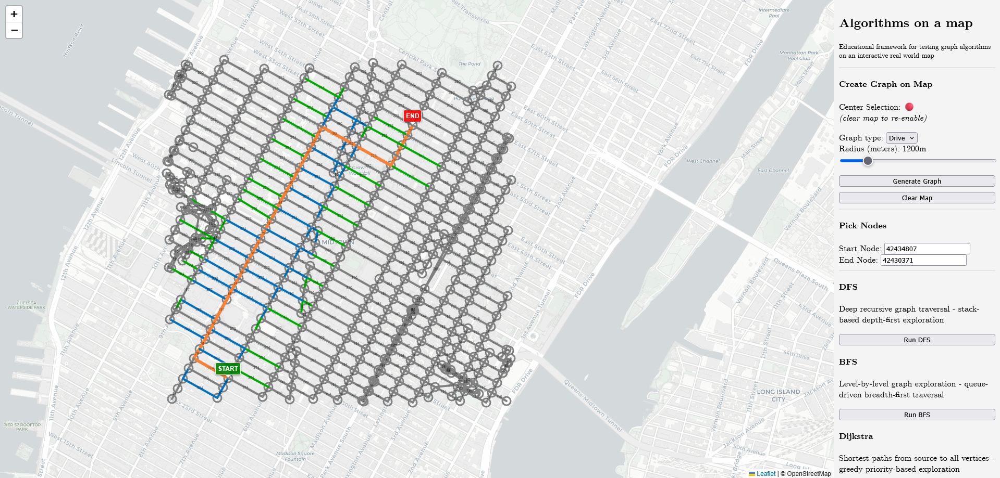

# Algorithms on a map

Educational framework that utilizes `osmnx` and `cartocdn` in order to visualize path-finding (and other) algorithms live on the map.

## Installation
### Requirements

`pip install osmnx flask`

## Usage

`python backend.py` and then visit the browser link that appears as output.

